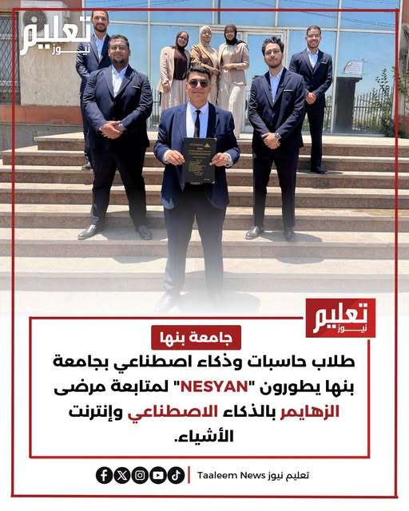

# Nesyan — AI-Powered Healthcare Platform for Alzheimer's Care


Backend for an AI-assisted healthcare ecosystem that connects Alzheimer's patients, caregivers, relatives, and doctors in one platform — covering patient care coordination, appointments, medication tracking, and AI-supported assistance.

## Overview

Nesyan is an AI-powered healthcare platform designed to support Alzheimer's patients, caregivers, relatives, and doctors through a centralized healthcare ecosystem.

This repository contains the backend implementation, built with ASP.NET Core following Onion Architecture principles.

## Project Recognition

> Graduation Project developed by students of the Faculty of Computer Science and Artificial Intelligence, Benha University.



## Features

- User Authentication & Authorization
- Patient Management
- Doctor Management
- Caregiver Management
- Relative Management
- Appointment & Treatment Requests
- Medical Reports Management
- Reminder & Medication Tracking
- Location Tracking Support
- AI Integration Support
- RESTful APIs

## Architecture

The project follows **Onion Architecture**.

| Layer | Responsibility |
|---------|---------|
| Domain | Core entities and business rules |
| Application | Use cases, DTOs and business logic |
| Infrastructure | Database and external services |
| API | Controllers and HTTP endpoints |

### Benefits

- Separation of Concerns
- Scalability
- Maintainability
- Testability


## Technology Stack

### Backend
- ASP.NET Core
- C#
- Entity Framework Core
- LINQ
- JWT Authentication

### Database
- SQL Server

### Architecture & Design Patterns
- Onion Architecture
- Repository Pattern
- Specification Pattern
- CQRS
- Dependency Injection

### Artificial Intelligence

- Natural Language Processing (NLP)
- Machine Learning Models
- Cognitive Assessment Models
### IoT Technologies

- ESP32
- GPS Module
- MAX30100
- MPU6050

### Development Tools

- Visual Studio
- Git
- GitHub
- Postman
- Swagger

## Project Structure

```text
src
├── APIs
│   ├── BFCAI.Nesyan.APIs
│   └── BFCAI.Nesyan.Controllers
│
├── Core
│   ├── BFCAI.Nesyan.Application
│   ├── BFCAI.Nesyan.Application.Abstraction
│   └── BFCAI.Nesyan.Domain
│
├── Infrastructure
│   ├── BFCAI.Nesyan.Infrastructure
│   └── BFCAI.Nesyan.Infrastructure.Persistence
│
├── UI
│
└── test
    └── BFCAI.Nesyan.Tests
```


## Database Design


## API Documentation

Swagger documentation is available when running the project.


## My Contribution

- Designed and implemented Backend Architecture using Onion Architecture.
- Built RESTful APIs using ASP.NET Core.
- Implemented JWT Authentication and Authorization.
- Developed Patient, Doctor, Caregiver and Relative modules.
- Implemented Appointment and Treatment Request features.
- Applied Repository and Specification Patterns.
- Designed and managed SQL Server database structure.
- Participated in API documentation and testing.

## AI & IoT Features

### Artificial Intelligence

- AI-Powered Symptom Analysis
- Natural Language Processing (NLP)
- Cognitive Decline Assessment
- Healthcare Recommendation Engine
- Voice Recognition
- Speaker Identification

### Internet of Things (IoT)

- GPS-Based Patient Tracking
- Real-Time Health Monitoring
- Sensor Data Collection
- Emergency Alert Support

### Smart Healthcare Services

- Medication Reminder System
- Appointment Management
- Treatment Request Management
- Patient-Caregiver Coordination
- Medical Report Management

## Team

Faculty of Computer Science and Artificial Intelligence, Benha University.

## Contact

**Ibrahim Mokhtar Ahmed Saad**

- LinkedIn: https://linkedin.com/in/ibrahim-mokhtar-16966a378
- GitHub: https://github.com/Ibrahim-Mokhtar
- Email: ibrahim.mokhtar1611@gmail.com
